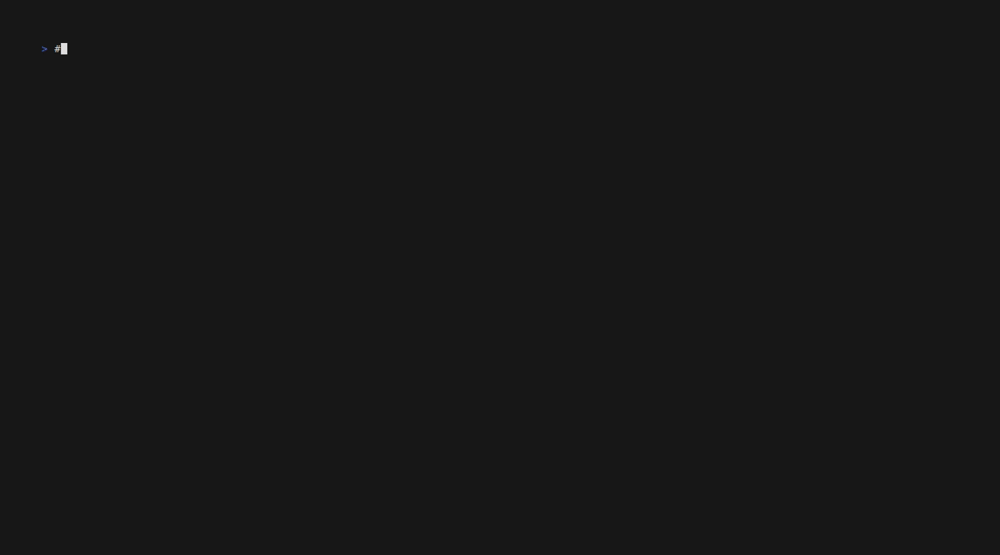

# NVIX - TVIX services backed by NATS

[](http://godoc.org/github.com/brianmcgee/nvix)

[](https://coveralls.io/github/brianmcgee/nvix)

Status: _ACTIVE_

This project came into this world as part of the Hackday at [NixCon 2023](https://2023.nixcon.org/).

It's primary focus is implementing [TVIX](https://cs.tvl.fyi/depot/-/tree/tvix) services using [NATS](https://nats.io).

## Roadmap

-   [x] Store
    -   [x] Blob Service
    -   [x] Path Info Service
    -   [x] Directory Service
-   [ ] Improve test coverage
-   [ ] Add more metrics

## Requirements

You must be familiar with and have the following installed:

-   [Direnv](https://direnv.net)
-   [Nix](https://nixos.org)

## Quick Start

After cloning the repository cd into the root directory and run:

```terminal
direnv allow
```

You will be asked to accept config for some additional substituters to which you should select yes.

Once the dev shell has finished initialising you will then be met with the following:

```terminal
🔨 Welcome to devshell

[checks]

  check      - Run all linters and build all packages
  fix        - Remove unused nix code
  fmt        - Format the repo

[development]

  dev        - Run local dev services
  dev-init   - Re-initialise state for dev services
  enumer     - Go tool to auto generate methods for enums
  evans      - More expressive universal gRPC client

[docs]

  gifs       - generate all gifs used in docs
  vhs        - A tool for generating terminal GIFs with code

[general commands]

  menu       - prints this menu

[nats]

  nats       - NATS Server and JetStream administration
  nsc        - Creates NATS operators, accounts, users, and manage their permissions

[tvix]

  tvix
  tvix-store

direnv: export +BLOB_SERVICE_ADDR +DEVSHELL_DIR +DIRECTORY_SERVICE_ADDR +GOROOT +IN_NIX_SHELL +NATS_HOME +NATS_JWT_DIR +NIXPKGS_PATH +NKEYS_PATH +NSC_HOME +PATH_INFO_SERVICE_ADDR +PRJ_DATA_DIR +PRJ_ROOT +TVIX_HOME +TVIX_MOUNT_DIR +name -NIX_BUILD_CORES -NIX_BUILD_TOP -NIX_STORE -TEMP -TEMPDIR -TMP -TMPDIR -builder -out -outputs -stdenv -system ~LD_LIBRARY_PATH ~PATH ~XDG_DATA_DIRS
```

To start the local dev services type `dev`.



You must wait until `nsc-push` has completed successfully and `nats-server` and `nvix-store` are in the running state.

With the dev services up and running you can now import paths and explore the TVIX store with the following:

```terminal
❯ tvix-store import pkg                 # imports the pkg source directory
  2023-09-12T09:16:07.507131Z  INFO tvix_store: import successful, path: "pkg", name: b"hr72zqz792b8s20aqm02lkmzidnxli77-pkg", digest: "sYpXtNHyUKRRRu4nnl0/o9bx2qk5DA0HNQgxsB4Hb4o="
    at src/bin/tvix-store.rs:308

❯ tvix-store mount -l $TVIX_MOUNT_DIR   # mounts the store into a directory within .data
  2023-09-12T09:16:18.571878Z  INFO tvix_store: mounting tvix-store on "/home/brian/Development/github.com/brianmcgee/nvix/.data/mount"
    at src/bin/tvix-store.rs:294
```

In a separate terminal you can explore the contents of the TVIX store:

```terminal
❯ tree $TVIX_MOUNT_DIR
/home/brian/Development/github.com/brianmcgee/nvix/.data/mount
└── hr72zqz792b8s20aqm02lkmzidnxli77-pkg
    └── store
        ├── blob
        │   ├── blob.go
        │   ├── blob_test.go
        │   └── helper_test.go
        └── subject
            └── blob.go
```

## License

This software is provided free under the [MIT Licence](https://opensource.org/licenses/MIT).

## Contact

There are a few different ways to reach me, all of which are listed on my [website](https://bmcgee.ie/).
